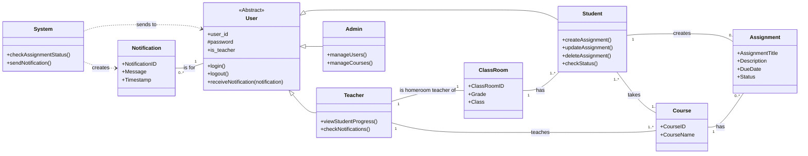

# nittc2025-j4exp-3

This document provides a comprehensive overview and technical breakdown of the `nittc` project, an in-class assignment management system designed for educational institutions.

## 1. Overview

### 1.1 Background
In the client's school, students currently manage their own assignments, and there is no centralized system for teachers to track the submission status of each student in real-time. This delay in awareness makes it difficult to provide timely and necessary support, such as individual guidance, to students who are prone to late submissions. Furthermore, information about assignments, such as deadlines and course details, is not shared centrally, making it difficult for the entire class to have a clear and unified understanding of the workload.

### 1.2 Project Goal
The goal of this project is to develop a web application that facilitates task and assignment management between students and teachers, streamlining communication and improving the tracking of academic progress.

### 1.3 Users and Roles
The system is architected around three distinct user roles with specific permissions and responsibilities:

*   **Student**: Creates, updates, and manages their own assignments. They can view the status of their tasks for the courses they are enrolled in.
*   **Teacher**: Oversees student assignments within their designated homerooms and courses. They can view student progress in real-time and access an audit trail of assignment updates.
*   **Administrator**: A non-teaching staff role responsible for system-level data management. This includes bulk importing users (Students, Teachers) and establishing relationships (e.g., Teacher-to-Classroom, Teacher-to-Course) via CSV file uploads through the Django admin interface.

## 2. Key Features & Core Functionality

This application is built with a focus on administrative efficiency, data integrity, and role-based access control.

*   **Custom Authentication**: User authentication is based on a unique `user_id`, not Django's default username or an email address, to align with institutional standards.
*   **Bulk Data Management**: Administrators can efficiently create users and populate course/classroom relationships by importing data from CSV files, significantly reducing manual setup time.
*   **Role-Based Access Control (RBAC)**: The system enforces strict permissions. Students can only view and edit their own data. Teachers have a consolidated view of all assignments from students they are responsible for (either as a homeroom teacher or a course instructor).
*   **Dynamic Data Filtering**: Forms and views dynamically filter data based on the logged-in user's context. For instance, a student creating a new assignment will only see a list of courses in which they are currently enrolled.
*   **Assignment Auditing**: The system integrates `django-auditlog` to track and display changes to critical models like `Assignment`, providing a clear and accessible audit trail for teachers to monitor updates and submissions.
*   **Data-Driven Logic**: The application is designed to derive configurations, such as course enrollments and academic terms, directly from imported data rather than relying on hardcoded values.

## 3. Technology Stack and Environment

*   **Python Version**: `>=3.14`
*   **Core Framework**: `django==5.2.7`
*   **Database**: Configured to use `sqlite3` by default.
*   **Key Libraries**:
    *   `django-bootstrap5==23.1.0`: For a modern, responsive frontend user interface.
    *   `django-auditlog`: Integrated for tracking model changes and providing an audit trail.
    *   `django-debug-toolbar`: Included for development and debugging purposes.
*   **Localization**: Configured for a Japanese audience (`LANGUAGE_CODE = 'ja'`, `TIME_ZONE = 'Asia/Tokyo'`).

## 4. System Architecture

The project follows a standard Django architecture with a main project directory (`nittc`) and two primary applications: `accounts` for user management and `task` for core academic functionality.

### 4.1 `accounts` Application: User Management & Authentication

This application implements a fully customized user and authentication system.

*   **Data Models**:
    *   **`CustomUser` Model**: Inherits from `AbstractBaseUser` and `PermissionsMixin` for complete control. The authentication field (`USERNAME_FIELD`) is set to `'user_id'`. A single `is_teacher` `BooleanField` efficiently distinguishes between user roles within one database table.
    *   **`Teacher` and `Student` Proxy Models**: This architecture leverages proxy models (`proxy = True`) to provide role-specific interfaces, admin views, and managers (`TeacherManager`, `StudentManager`) without creating separate database tables. This is an efficient and clean design choice where custom managers automatically filter querysets based on the `is_teacher` flag.

*   **Access Control (`accounts/mixins.py`)**:
    *   **`StudentRequiredMixin`** and **`TeacherRequiredMixin`** are used to protect class-based views. They inspect `request.user.is_teacher` to grant or deny access, providing a clean, declarative, and reusable method for view-level authorization.

### 4.2 `task` Application: Core Academic Functionality

This application manages the core entities: classrooms, courses, and assignments.

*   **Data Models**:
    *   **`ClassRoom`**: Represents a class (e.g., "1-1"). Linked to both `Teacher` (for homeroom teachers) and `Student` via `ManyToManyField`.
    *   **`Course`**: Represents a subject (e.g., "Math"). Linked to a `ClassRoom` and to `Teacher`s who instruct it.
    *   **`Assignment`**: The central model for student work. It is linked to a `Student` and a `Course` and features a `status` field to track its lifecycle (e.g., "In Progress," "Submitted").

*   **Views and Business Logic**:
    *   **Student Views**:
        *   `CreateAssignment`: Allows a student to create an assignment.
        *   `StudentAssignmentView`: A `ListView` displaying assignments belonging only to the logged-in student.
        *   `StudentAssignmentEditView`: An `UpdateView` with a security check in `get_object` to ensure students can only edit their *own* assignments.
    *   **Teacher Views**:
        *   `TeacherAssignmentView`: A `ListView` with a complex `get_queryset` method that aggregates all assignments from students for whom the teacher is responsible. The query is optimized with `select_related` and `distinct()`.
        *   `TeacherLogView`: A `ListView` that integrates with `django-auditlog` to provide teachers with an audit trail of changes to relevant assignments.

*   **Forms**:
    *   **`AssignmentCreateForm`**: A key feature of this form is its `__init__` method, which accepts the `user` object and dynamically filters the `course` field's queryset to show *only* courses that the student is enrolled in. It also includes validation to prevent setting due dates in the past.

## 5. Admin Interface and Data Management

The Django admin is heavily customized for administrative efficiency, particularly for bulk data handling.

*   **Role-Specific Admin Views**: `TeacherAdmin` and `StudentAdmin` are registered for the proxy models, ensuring that each list view displays only users of the correct role.
*   **Optimized CSV Bulk Import**: Custom admin views provide a UI for bulk creation of users, courses, and classrooms from CSV files. The import logic is highly robust and optimized:
    1.  **Atomicity**: The entire import is wrapped in `transaction.atomic()` to guarantee all-or-nothing data consistency.
    2.  **Query Optimization**: Existing objects are pre-fetched into memory to prevent N+1 queries inside the processing loop.
    3.  **Bulk Operations**: New objects and their many-to-many relationships are created using single `bulk_create()` calls, which is the most performant method in Django.

## 6. Data Schema

The relationships between the core models are visualized in the class diagram below.

## 7. Testing Strategy

The project includes a comprehensive test suite that validates:
*   **Model Integrity**: Correctness of `__str__` methods, default values, and relationships.
*   **Form Logic**: Validation rules and the critical dynamic filtering of courses based on user enrollment.
*   **View Security**: Strict enforcement of role-based access, authentication requirements, and correct data scoping (ensuring users only see their own data and are denied access to others').