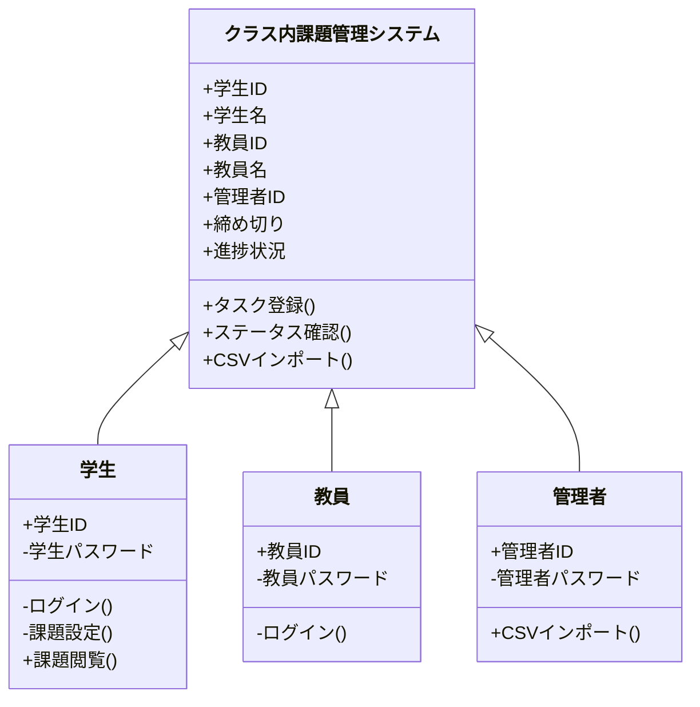

# nittc2025-j4exp-3

# 仕様書

## 1.概要
### 1.1背景
### 1.2プロジェクトのゴール
学生と教員の間のタスク管理をするアプリケーションツールの作成
### 1.3利用者と役割
学生
- 「科目」「課題の内容」「締め切り」「状況」のステータスの入力を行う
- あくまでも自分で管理

教員
- 科目名の作成（要確認）
  - 管理者がいるのか？
- 生徒が作成したタスクの閲覧
- リマインド機能
- 登録内容のログ(リアルタイムに)

## 2.機能要件
### 2.1機能一覧
- タスク登録機能
- ステータス確認機能
- リマインド機能
- 他人の進捗に応じた通知機能
- 過去プロジェクトであるcsvファイルの流用

### 2.2　機能詳細
#### 2.2.1　タスク登録機能
利用者：学生
タスクをテキストでの登録か、タブから選択するのか

#### 2.2.2 ステータス確認機能
利用者：学生、教員
進捗状況の確認
- 取組中
- 提出済み
- 再提出で取組中
- 再提出済み

#### 2.2.3 リマインド機能
教員からの期限間近のタスクに関するリマインド

#### 2.2.4 他人の進捗に応じたリマインド機能
他人がタスクを完了したらそれを同じクラスの人に通知する
急かすイメージ
課題の登録は学生自身が行う？学生自身が行う場合どうなる？

#### 2.2.5 過去のプロジェクトであるcsvファイルの流用
科目コードなどから科目名と担当教員名の抽出

## 3.非機能要件
|項目|要件|
|:--|:--|
|開発環境|Django(Pythonベース)|
|使用サーバ|Xserver|
|動作環境|何のブラウザに対応？|
|ユーザビリティ|使用感はどんな感じ？|
|セキュリティ|どこまでのセキュリティ？2FA?|

## 4.データ要件

|データ分類|データ概要|
|:--|:--|
|生徒情報|学籍番号などの個人特定が可能なID、それに紐づくパスワード|
|教員情報|ほぼ学生と同じ|
|科目情報|科目名、担当教員名|
|課題進捗情報|科目名、個人名、締切、進捗状況|

