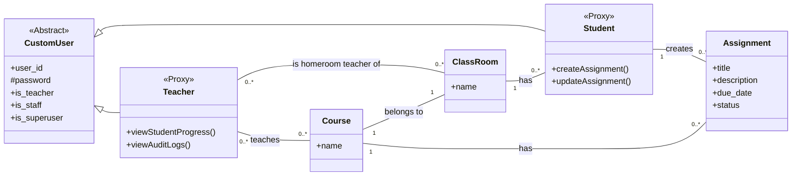

# nittc2025-j4exp-3

This document provides a comprehensive overview and technical breakdown of the `nittc` project, an in-class assignment management system designed for educational institutions.

## 1. Overview

### 1.1 Background
In the client's school, students currently manage their own assignments, and there is no centralized system for teachers to track the submission status of each student in real-time. This delay in awareness makes it difficult to provide timely and necessary support, such as individual guidance, to students who are prone to late submissions. Furthermore, information about assignments, such as deadlines and course details, is not shared centrally, making it difficult for the entire class to have a clear and unified understanding of the workload.

### 1.2 Project Goal
The goal of this project is to develop a web application that facilitates task and assignment management between students and teachers, streamlining communication and improving the tracking of academic progress.

### 1.3 Users and Roles
The system is architected around three distinct user roles with specific permissions and responsibilities:

*   **Student**: Creates, updates, and manages their own assignments. They can view the status of their tasks for the courses they are enrolled in.
*   **Teacher**: Oversees student assignments within their designated homerooms and courses. They can view student progress in real-time and access an audit trail of assignment updates.
*   **Administrator**: A non-teaching staff role responsible for system-level data management. This includes bulk importing users (Students, Teachers) and establishing relationships (e.g., Teacher-to-Classroom, Teacher-to-Course) via CSV file uploads through the Django admin interface.

## 2. Key Features & Core Functionality

This application is built with a focus on administrative efficiency, data integrity, and role-based access control.

*   **Custom Authentication**: User authentication is based on a unique `user_id`, not Django's default username or an email address, to align with institutional standards.
*   **Bulk Data Management**: Administrators can efficiently create users and populate course/classroom relationships by importing data from CSV files, significantly reducing manual setup time.
*   **Role-Based Access Control (RBAC)**: The system enforces strict permissions. Students can only view and edit their own data. Teachers have a consolidated view of all assignments from students they are responsible for (either as a homeroom teacher or a course instructor).
*   **Dynamic Data Filtering**: Forms and views dynamically filter data based on the logged-in user's context. For instance, a student creating a new assignment will only see a list of courses in which they are currently enrolled.
*   **Assignment Auditing**: The system integrates `django-auditlog` to track and display changes to critical models like `Assignment`, providing a clear and accessible audit trail for teachers to monitor updates and submissions.
*   **Data-Driven Logic**: The application is designed to derive configurations, such as course enrollments and academic terms, directly from imported data rather than relying on hardcoded values.

## 3. Technology Stack and Project Configuration

*   **Python Version**: `>=3.14`
*   **Core Framework**: `django==5.2.7`
*   **Database**: Configured to use `sqlite3` by default.
*   **Key Libraries**:
    *   `django-bootstrap5==23.1.0`: For a modern, responsive frontend user interface.
    *   `django-auditlog==2.2.0`: Integrated for tracking model changes and providing an audit trail.
    *   `django-debug-toolbar`: Included for development and debugging purposes.
*   **Global Settings (`nittc/settings.py`)**:
    *   `AUTH_USER_MODEL = 'accounts.CustomUser'`: This critical setting replaces Django's default User model with a custom implementation, enabling specialized fields and `user_id`-based authentication.
    *   `INSTALLED_APPS`: Correctly registers the custom `accounts` and `task` applications alongside third-party apps like `django_bootstrap5` and `auditlog`.
    *   **Localization**: Configured for a Japanese audience (`LANGUAGE_CODE = 'ja'`, `TIME_ZONE = 'Asia/Tokyo'`).

## 4. System Architecture

The project follows a standard Django architecture with a main project directory (`nittc`) and two primary applications: `accounts` for user management and `task` for core academic functionality.

### 4.1 Global Configuration (`nittc` Project)
The central `nittc` project directory handles global settings and URL routing. The main `nittc/urls.py` acts as the primary URL dispatcher, using `include()` to delegate routing to the `accounts` and `task` applications, promoting a modular and organized structure.

### 4.2 `accounts` Application: User Management & Authentication

This application implements a fully customized user and authentication system tailored to the project's requirements.

*   **Data Models (`accounts/models.py`)**:
    *   **`CustomUser` Model**: Inherits from `AbstractBaseUser` and `PermissionsMixin` for complete control over the user model. The authentication field (`USERNAME_FIELD`) is set to `'user_id'`. A single `is_teacher` `BooleanField` serves as the primary discriminator between Teacher and Student roles, allowing all users to be stored efficiently in a single database table.
    *   **`Teacher` and `Student` Proxy Models**: This architecture leverages proxy models (`proxy = True`) to provide role-specific business logic, admin views, and custom managers (`TeacherManager`, `StudentManager`) without creating separate database tables. This is an efficient design where custom managers automatically filter `CustomUser` querysets based on the `is_teacher` flag (e.g., `Student.objects.all()` only returns users where `is_teacher=False`).

*   **Access Control (`accounts/mixins.py`)**:
    *   **`StudentRequiredMixin`** and **`TeacherRequiredMixin`** are custom authorization mixins inheriting from `AccessMixin`. They inspect `request.user.is_teacher` in the `dispatch` method to protect class-based views, ensuring only users with the appropriate role can access them. This provides a clean, declarative, and reusable method for view-level authorization.

### 4.3 `task` Application: Core Academic Functionality

This application manages the core entities: classrooms, courses, and assignments, along with the associated business logic.

*   **Data Models (`task/models.py`)**:
    *   **`ClassRoom`**: Represents a class (e.g., "1-1"). It has `ManyToManyField` relationships to both `Teacher` (for homeroom teachers) and `Student`.
    *   **`Course`**: Represents a subject (e.g., "Math"). Linked to a `ClassRoom` via a `ForeignKey` and to `Teacher`s who instruct it via a `ManyToManyField`.
    *   **`Assignment`**: The central model for student work. It is linked to a `Student` and a `Course` via `ForeignKey`s and features a `status` field (`SmallIntegerField` with choices) to track its lifecycle (e.g., "In Progress," "Submitted," "Accepted").

*   **Views and Business Logic (`task/views.py`)**:
    *   **Student Views**:
        *   `StudentAssignmentView`: A `ListView` displaying assignments belonging only to the logged-in student.
        *   `CreateAssignment`: A `CreateView` that allows a student to create an assignment. Its associated form dynamically filters the `Course` dropdown to show only relevant courses.
        *   `StudentAssignmentEditView`: An `UpdateView` with a security check in the `get_object` method to ensure students can only edit their *own* assignments, raising `PermissionDenied` if unauthorized access is attempted.
    *   **Teacher Views**:
        *   `TeacherAssignmentView`: A `ListView` with a complex `get_queryset` method. It uses `Q` objects to aggregate all assignments from students for whom the teacher is responsible (either as a homeroom teacher or a course instructor). The query is highly optimized with `select_related` and `distinct()` to prevent performance issues.
        *   `TeacherLogView`: A `ListView` that integrates with `django-auditlog`. Its `get_queryset` first identifies all `Assignment` primary keys relevant to the teacher, then filters the `LogEntry` model for changes to those specific objects, providing a targeted and secure audit trail.

*   **Forms (`task/forms.py`)**:
    *   **`AssignmentCreateForm` / `AssignmentEditForm`**: A key feature of these forms is the overridden `__init__` method, which accepts the `user` object. It dynamically filters the `course` field's queryset to show *only* courses that the student is enrolled in. Both forms also include custom validation (`clean_due_date`) to prevent setting due dates in the past.

## 5. Admin Interface and Data Management

The Django admin is heavily customized to serve as a powerful administrative dashboard, particularly for bulk data handling.

*   **Role-Specific Admin Views**: `TeacherAdmin` and `StudentAdmin` are registered for the proxy models. Each `ModelAdmin` class overrides `get_queryset()` to ensure its list view displays only users of the correct role and `save_model()` to automatically set the `is_teacher` flag correctly upon creation.
*   **Optimized CSV Bulk Import**: A custom admin view provides a UI for bulk creation of users, courses, and classrooms from CSV files. The import logic is highly robust and optimized for performance and data integrity:
    1.  **Atomicity**: The entire import process is wrapped in `transaction.atomic()` to guarantee all-or-nothing data consistency. If any row in the CSV fails, the entire transaction is rolled back.
    2.  **Query Optimization**: To prevent N+1 queries, existing objects (like user IDs or ClassRoom names) are pre-fetched into memory (sets or dictionaries) before the main processing loop begins.
    3.  **Bulk Operations**: New objects are created using a single `Model.objects.bulk_create()` call, which is the most performant method for inserting many records in Django. For complex relationships, it also uses `bulk_create` on the M2M `through` model.

## 6. Frontend and UI

The project utilizes `django-bootstrap5` to create a modern, responsive user interface.

*   **Role-Specific Layouts**: Separate base templates (`student_base.html`, `teacher_base.html`) and home pages (`student_home.html`, `teacher_home.html`) provide tailored dashboards and navigation for each user role.
*   **Custom Admin Templates**: The Django admin's `change_list.html` is extended to add custom "Import from CSV" buttons. A generic `csv_form.html` provides a consistent UI for all CSV upload interfaces, including instructions on the required data format.
*   **Audit Log Template (`log_for_teacher.html`)**: This template demonstrates sophisticated logic to parse and display audit log data from `django-auditlog`, presenting create, update, and delete actions in a clear, human-readable format for teachers.

## 7. Data Schema

The relationships between the core models are visualized in the class diagram below.

## 8. Testing and Quality Assurance

The project includes a comprehensive test suite for the `accounts` and `task` applications, demonstrating a commitment to code quality and reliability.

*   **Model Tests**: Verify model defaults, `__str__` representations, database relationships, and custom manager logic.
*   **Form Tests**: Validate form logic, including error handling for invalid data (e.g., past due dates) and the critical dynamic filtering of the `course` queryset based on user enrollment.
*   **View Tests**: Provide extensive coverage for access control, ensuring that each user role can only access appropriate views and that unauthenticated users are properly redirected. They confirm that querysets are correctly scoped (e.g., a student sees only their own assignments) and that attempts to access another user's data are denied.