# nittc2025-j4exp-3

# 仕様書

## 1.概要
### 1.1背景
 クライアントの学校では現在、学生の課題管理について、学生が各自で管理しており、教員が学生一人ひとりの課題提出状況をリアルタイムで把握する方法がないという課題を抱えている。このため、課題の提出が遅れがちな学生に対し、個別指導などの必要なサポートを迅速に行うことが困難となり、状況把握の遅れが生じている。
 また、科目ごとにどのような課題が設定され、いつ提出期限なのかといった情報が、科目担当教員から一元的に共有されていないこともあり、クラス全体で課題状況を確実に把握することが難しい状況である。

### 1.2プロジェクトのゴール
学生と教員の間のタスク管理をするアプリケーションツールの作成
### 1.3利用者と役割
学生
- 「科目」「課題の内容」「締め切り」「状況」のステータスの入力を行う
- 提出状況のステータスの確認

教員
- 学生が登録した課題の内容，状況閲覧
  - リアルタイムでのログの閲覧
- 課題登録や提出のリマインド登録
  - "課題のステータスが変わらない場合のリマインド機能"

管理者
- コース登録
  - CSVファイルからのインポートを想定

## 2.機能要件
### 2.1機能一覧
<!-- ダイアログ2ページ目6行目 -->
- タスク登録機能

<!-- ダイアログ2ページ目9行目 -->
- ステータス確認機能

<!-- ダイアログ3ページ目4行目 -->
- サジェスト機能

<!-- ダイアログ3ページ9行目 -->
- リマインド機能

<!-- ダイアログ3ページ2行目 -->
- 過去プロジェクトであるcsvファイルの流用

### 2.2　機能詳細
#### 2.2.1　タスク登録機能
利用者：学生
科目名を既存の選択肢から選択，課題のタイトル，概要を記述し締切日をカレンダーから設定，課題別に提出状況を選択する．

#### 2.2.2 ステータス確認機能
利用者：学生、教員
各学生の課題取り組み状況を取り組み状況確認ページから確認できる。また、取り組み状況の表示は以下のとおりである。
- 取組中
- 提出済み
- 再提出で取組中
- 再提出済み

#### 2.2.3 リマインド機能
利用者：教員
課題登録や提出へのリマインドを行う．

#### 2.2.4 サジェスト機能
利用者：システム
学生がタスクを登録したら，他の学生に登録された事実を通達する．

#### 2.2.5 過去のプロジェクトであるcsvファイルの流用
利用者：管理者
以前に納品した「時間割編成システム」より出力されるCSVファイルから「科目ID」「教員ID」を抽出する．

## 3.非機能要件
|項目|要件|
|:--|:--|
|開発環境|Django|
|使用サーバ|Xserver|
|動作環境|**未定義**|
|セキュリティ|IDとパスワードによる認証|

## 4.データ要件

以下にデータ要件を示した表とクラス図を示す．

    表1.データ要件を示した表

|データ分類|データ概要|
|:--|:--|
|生徒|ID,パスワード|
|教員|ID,パスワード|
|管理者|ID,パスワード|
|科目|ID,コース名|
|課題|タイトル，概要，締め切り日，状況|

```mermaid
classDiagram
    direction LR

    class User {
        <<Abstract>>
        +ID
        #パスワード
        +login()
        +logout()
        +receiveNotification(notification)
    }

    class Student {
        +createAssignment()
        +updateAssignment()
        +deleteAssignment()
        +checkStatus()
    }

    class Teacher {
        +viewStudentProgress()
        +checkNotifications()
    }

    class Admin {
        +manageUsers()
        +manageCourses()
    }

    class Course {
        +CourseID
        +CourseName
    }

    class Assignment {
        +AssignmentTitle
        +Description
        +DueDate
        +Status
    }

    class ClassRoom {
        +ClassID
        +ClassName
    }

    class System {
        +checkAssignmentStatus()
        +sendNotification()
    }

    class Notification {
        +NotificationID
        +Message
        +Timestamp
    }


    User <|-- Student
    User <|-- Teacher
    User <|-- Admin

    %% 学生(複数)はクラスルーム(1)に所属する
    ClassRoom "1" -- "1..*" Student : has

    %% HR担任(1)はクラスルーム(1)を担当する
    Teacher "1" -- "1" ClassRoom : is homeroom teacher of

    %% 学生(複数)はコース(複数)を受講する
    Student "1..*" -- "1..*" Course : takes

    %% 教科担当(1)はコース(複数)を教える
    Teacher "1" -- "1..*" Course : teaches

    %% 学生(1)が課題(複数)を作成
    Student "1" -- "0..*" Assignment : creates

    %% 課題(複数)はコース(1)に紐づく
    Course "1" -- "0..*" Assignment : has

    %% システムが通知を生成し、ユーザーに送信する
    System ..> Notification : creates
    System ..> User : sends to

    %% 通知はユーザー(1)に紐づく
    Notification "0..*" -- "1" User : is for
%% classDiagram
%%     direction LR

%%     class User {
%%         <<Abstract>>
%%         +ID
%%         #パスワード
%%         +login()
%%         +logout()
%%     }

%%     class Student {
%%         +createAssignment()
%%         +updateAssignment()
%%         +deleteAssignment()
%%         +checkStatus()
%%     }

%%     class Teacher {
%%         +viewStudentProgress()
%%     }

%%     class Admin {
%%         +manageUsers()
%%         +manageCourses()
%%     }

%%     class Course {
%%         +CourseID
%%         +CourseName
%%     }

%%     class Assignment {
%%         +AssignmentTitle
%%         +Description
%%         +DueDate
%%         +Status
%%     }

%%     %% class System{
%%     %%     +ViewStudentStuts
%%     %%     +remind()
%%     %% }

%%     User <|-- Student
%%     User <|-- Teacher
%%     User <|-- Admin

%%     %% 学生(複数)はコース(複数)を受講する
%%     Student "1..*" -- "1..*" Course : takes
%%     %% %% システム(複数)は学生(複数)にリマインドする
%%     %% System "1" -- "1*" Student : remind
%%     %% 教師(1)は科目(複数)を教える
%%     Teacher "1" -- "1..*" Course : teaches


%%     %% 学生(1)が課題(複数)を作成
%%     Student "1" -- "0..*" Assignment : creates

%%     %% 課題(1)が科目(複数)に紐づく
%%     Course "1" -- "0..*" Assignment : belongs to
```

    図1.クラス図

## 5.導入後の業務フロー